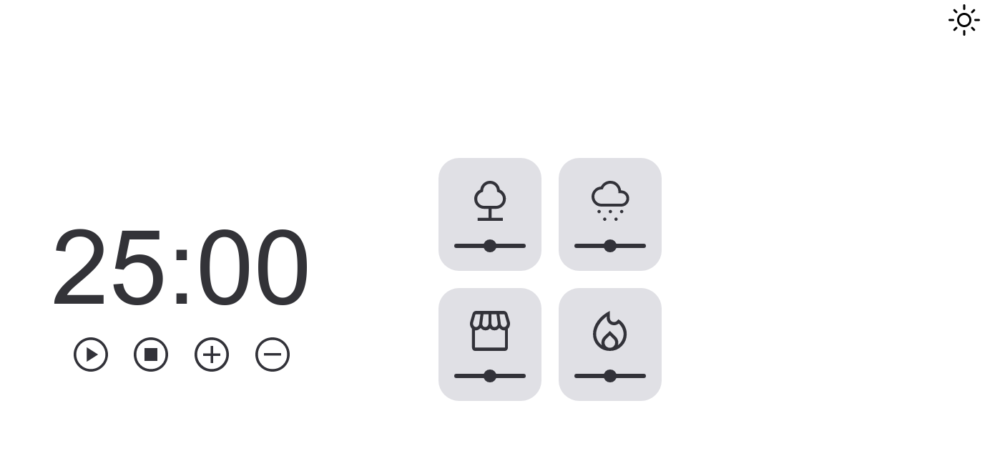
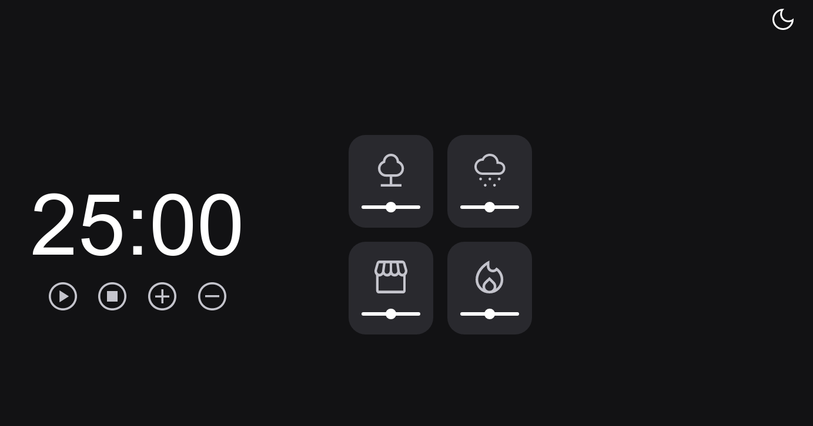

# F o c u s ~T i m e r  - 2.0

Projeto de um temporizador no estilo Pomodoro com controle de volume nos sons e modo escuro.

## Pré visualização

## Sobre

Este é um dos projetos propostos no programa [Explorer da Rocketseat](https://www.rocketseat.com.br/explorer) , consiste numa versão mais avançada do temporizador pomodoro, aonde o usuário poderá definir um tempo, com a possibilidade de adicionar ou diminuir 5 minutos, com 4 opções de sons ambientes, cada um com seu botão de volume, além do modo escuro.

 [Clique aqui para acessar !](https://tartarottipaula.github.io/Focus-Timer-Dark-Mode)

## ⌨️ Tecnologias

- HTML
- CSS
- JavaScript
- Git

## Conceitos Aplicados no Projeto:

- Clean Code;
- Refatoração.
- Modularização;
- Desestruturação;
- Injeção de dependências;
- Objetos com o padrão factory;

##  ❤️ Contato
- paula.tcelso@gmail.com
- [LinkedIn.](https://www.linkedin.com/in/paulatartarotticelso/)
